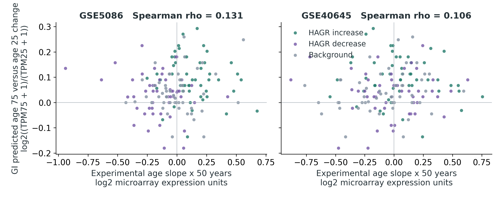
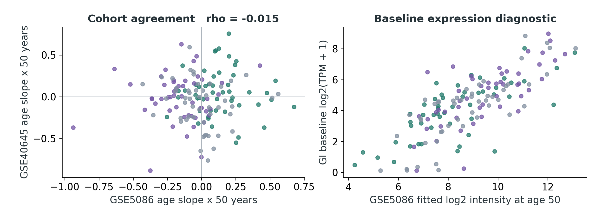
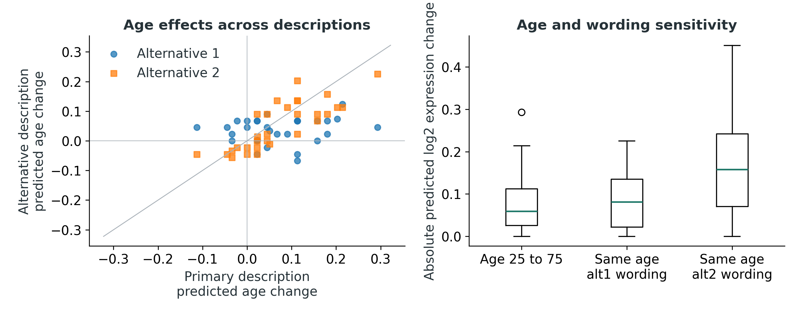

# GI Expression Predictions of Age Related Changes in Human Muscle

*Preliminary 150 gene study  |  3 October 2026*

*Converted from [gi_age_expression_150_gene_report.docx](gi_age_expression_150_gene_report.docx); the DOCX is the source of record.*

The pilot did not establish a reproducible positive association between predicted age effects and experimental age effects across both cohorts.

The experimental references also show weak agreement with one another: Spearman correlation -0.015 and 48.7% direction agreement. Consequently, disagreement with these outcomes alone cannot diagnose a failure of the model’s age conditioning.

Genomic Intelligence (GI) predicts gene expression from a DNA sequence and a text description of the biological context. This experiment asked whether changing only the donor age in that description produces gene-specific changes that follow published age-associated expression changes in human muscle. The model was used without training or fine-tuning.

| **Primary comparison**              |   **GSE5086**   |  **GSE40645**   |
|:------------------------------------|:---------------:|:---------------:|
| Genes compared                      |       150       |       150       |
| Spearman rank correlation           |      0.131      |      0.106      |
| 95% gene bootstrap interval         | -0.032 to 0.299 | -0.056 to 0.263 |
| Expression-stratified permutation P |      0.125      |      0.191      |
| Balanced direction accuracy         |      47.1%      |      50.1%      |

<figure>

<figcaption aria-hidden="true">
Figure 1. Each point is a gene. Positive values indicate higher expression with greater age. The experimental value is a published age slope multiplied by 50 years; the GI value is the predicted age-75 versus age-25 log2 ratio with a 1 TPM pseudocount. Colours identify the three prespecified selection groups.
</figcaption>
</figure>

All 150 genes and 570 planned predictions completed successfully. This pilot tests age-conditioned predictions; it does not validate a biological age clock, a rejuvenation intervention, or a causal mechanism.

# How the experiment was performed

## Experimental reference data

Human Ageing Genomic Resources (HAGR) provides a global mammalian ageing expression signature. We reconstructed its 449 increasing and 162 decreasing genes from the significant entries in the Palmer et al. supplementary meta-analysis tables \[1–3\]. These global labels guided panel selection; the quantitative outcomes came from the published human muscle regressions below.

<table>
<colgroup>
<col style="width: 17%" />
<col style="width: 31%" />
<col style="width: 51%" />
</colgroup>
<thead>
<tr>
<th style="text-align: left;"><strong>Cohort</strong></th>
<th style="text-align: center;"><strong>Original sample catalogue</strong></th>
<th style="text-align: center;"><strong>Platform and muscle</strong></th>
</tr>
</thead>
<tbody>
<tr>
<td style="text-align: left;">GSE5086</td>
<td style="text-align: center;">81 samples 
Ages 16–89</td>
<td style="text-align: center;">Affymetrix arrays 
62 rectus abdominis and 19 other muscle sites</td>
</tr>
<tr>
<td style="text-align: left;">GSE40645</td>
<td style="text-align: center;">29 listed samples 
Ages 35–89</td>
<td style="text-align: center;">Illumina arrays 
Vastus lateralis</td>
</tr>
</tbody>
</table>

Sample counts and ranges describe the original GEO series \[4,5\], not a new donor-level analysis. We used the HAGR authors’ unadjusted gene-wise regression slopes on processed log2 expression. Each slope was multiplied by 50 years for comparison with the model contrast. Age 25 lies outside GSE40645’s observed range: its scaled slope is not a directly measured age-25 versus age-75 difference. No raw donor data, adult-only filtering or covariate refitting was performed.

## Gene selection and fixed inputs

Eligibility required a gene to be measured in both cohorts and to have an unambiguous approved protein-coding HGNC record and Ensembl gene identifier. The eligible pool comprised 442 increasing, 162 decreasing and 16,154 background genes. With random seed 42, we selected 50 from each signature group and 50 background genes, giving 150 unique genes. Background genes were matched within 0.3 log2 units of GSE5086 fitted expression at age 50; the largest actual difference was 0.298. Their age slopes were not used to choose matches. Background genes are outside the global signature, not proven invariant with age.

The GxI expression workflow retrieved a 9,198-base GRCh38 DNA window centred on each gene’s transcription start site (TSS), in the gene’s orientation. Resolved Ensembl identifiers were checked against the frozen mapping. The same sequence handle was reused for all conditions of a gene. The model was g0-expression; its output was expression in transcripts per million (TPM), a normalized measure of RNA abundance \[6\].

## Exact primary descriptions

**Baseline:** Human skeletal muscle tissue from an adult donor.

**Young:** Human skeletal muscle tissue from a 25-year-old adult donor.

**Old:** Human skeletal muscle tissue from a 75-year-old adult donor.

The primary experiment used three predictions per gene, or 450 requests. A prespecified 30-gene subset, with 10 genes per group, received four additional wording-control requests each. No genes were selected or excluded based on their prediction quality.

# What the quantitative results mean

The primary statistic is Spearman correlation: it measures whether genes with larger predicted age changes also have larger experimental age changes. A value near zero indicates little rank association; a positive value indicates matching order. The metric does not require the two expression measurement scales to be calibrated to one another.

The P values are exploratory and unadjusted for multiple analyses. An expression-stratified permutation P value asks how often a shuffled pairing of gene effects, within expression strata, has at least as large an absolute correlation. It is not the probability that the model is correct.

| **Additional measure**                  | **GSE5086** | **GSE40645** |
|:----------------------------------------|:-----------:|:------------:|
| Nominal correlation P                   |    0.109    |    0.196     |
| Direction discrimination AUROC          |    0.570    |    0.573     |
| Raw direction agreement                 |    45.3%    |    48.7%     |
| Experimental increases / decreases      |   70 / 80   |   71 / 79    |
| Genes with experimental P below 0.05    |     37      |      19      |
| Genes with experimental BH q below 0.05 |      2      |      0       |

GI predicted 108 increases, 29 decreases and 13 exact zero changes. Balanced accuracy gives equal weight to detecting experimental increases and decreases; a zero prediction counts as incorrect for either nonzero direction. AUROC measures how well predicted changes rank experimental increases above decreases; 0.5 is chance-level discrimination. BH q values use the Benjamini–Hochberg false discovery correction across all tested genes in each source cohort, not just this selected panel.

## Descriptive comparisons by selection group

| **Spearman correlation within group** | **GSE5086** | **GSE40645** |
|:--------------------------------------|:-----------:|:------------:|
| HAGR increasing genes                 |   -0.153    |    -0.092    |
| HAGR decreasing genes                 |   -0.100    |    -0.003    |
| Expression matched background         |   -0.006    |    0.269     |

A separate secondary comparison used the 100 HAGR signature genes and their global increasing or decreasing labels. GI changes gave AUROC 0.707 and balanced accuracy 56.0%. These labels guided panel selection and pool mammalian tissues; this comparison is not independent validation of human muscle age slopes.

# Checking the experimental references

## Agreement between experimental cohorts

The experimental age slopes themselves correlated at -0.015, with 48.7% agreement in direction across the panel. This describes the consistency of the reference outcomes and should be considered when judging model agreement. Both cohorts contributed to the HAGR meta-analysis, so the second comparison provides another experimental dataset but is not independent of gene selection.

<figure>

<figcaption aria-hidden="true">
Figure 2. Left: agreement between the two experimental age slopes. Right: age-unspecified GI predictions against GSE5086 fitted microarray expression at age 50. The right-hand plot is a baseline expression diagnostic, not a test of ageing prediction or absolute expression calibration.
</figcaption>
</figure>

Baseline GI expression correlated with fitted expression at age 50 at 0.757 in GSE5086 and -0.018 in GSE40645. Correlation with experimental age slopes was -0.015 and 0.027, respectively. Microarray probe behaviour limits interpretation of between-gene intensity correlations.

An additional reference check found fitted expression agreement of -0.005 across 17,260 shared genes in the source tables. The cause of this near-zero baseline agreement is unresolved; GSE40645 identifiers and preprocessing warrant an audit before further biological interpretation. This check does not establish a specific mapping error.

# Sensitivity to equivalent wording

An age effect caused by the phrasing of a description can resemble a biological prediction. Thirty genes were therefore tested with two alternative descriptions that preserve tissue and donor age. The subset and descriptions were fixed before the main inference run.

**Alternative 1:** Human skeletal muscle tissue from an adult donor aged 25 years. The paired older description changes 25 to 75.

**Alternative 2:** Skeletal muscle tissue from a human adult donor who is 25 years old. The paired older description changes 25 to 75.

| **Wording control on 30 genes** | **Alternative 1** | **Alternative 2** |
|:---|:--:|:--:|
| Rank correlation with primary age effect | 0.196 | 0.853 |
| Age-effect sign reversals | 8 | 3 |
| Same-age wording shift / primary age shift | 1.38 | 2.67 |

<figure>

<figcaption aria-hidden="true">
Figure 3. Left: age effects from equivalent descriptions, with the diagonal showing identical predictions. Right: absolute primary age changes compared with changes caused only by rephrasing the age-25 description. All values use log2 expression ratios with a 1 TPM pseudocount.
</figcaption>
</figure>

The median absolute primary age change in this subset was 0.059 log2 units. Rewording the same age-25 context produced median absolute changes of 0.082 and 0.158. The ratios above divide these two medians; they are not per-gene ratios or statistical significance tests.

At least one equivalent description produced a typical same-age shift larger than the primary age shift. This limits the specificity of interpreting the primary text contrast as an ageing response.

Alternative-template correlations with the experimental outcomes and all 30 gene-level control results are included in the data bundle. No alternative was chosen after seeing its performance to replace the primary result.

# Interpretation and limits

The pilot did not establish a reproducible positive association between predicted age effects and experimental age effects across both cohorts. The study is useful as an executable benchmark for the age-context hypothesis and as a record of where the model and the reference data require further validation.

## What this pilot can support

The run establishes that the GI expression workflow can score a fixed, documented human gene panel across age descriptions and produce auditable quantitative comparisons. It reports both favourable and unfavourable metrics and preserves every completed request. Agreement is an association among genes in this selected panel, not evidence of an individual’s future expression trajectory.

## What remains unresolved

Reference uncertainty and confounding. Published age slopes were treated as fixed. The 95% intervals use 2,000 gene bootstrap resamples retaining the three panel group sizes; they do not propagate donor-level slope uncertainty or account for correlated genes. The 10,000 expression-stratified permutations test a conditional association within this panel. Neither procedure removes sex, anatomical site, cell-composition or other confounding. Many source slopes may be weak or uncertain, as the experimental significance counts show.

Selection and training independence. HAGR global labels pool species and tissues and need not agree with human muscle ageing. The two tested cohorts were included in that meta-analysis, and the panel deliberately enriches signature genes. The results cannot be generalized to all genes. GI training accessions and an immutable checkpoint hash were not exposed through the connector, so training overlap with the test studies is unknown. The catalogue describes human and mouse RNA-seq from ENCODE, GTEx via recount3 and cellxgene pseudobulk; it does not establish validated donor-age conditioning.

Measurement and biological scope. The model changes text while keeping the reference DNA fixed. It therefore probes context conditioning, not mutations accumulated with age. TPM and microarray intensities are different measurements, and this pilot assesses ranks and signs rather than numerical calibration. The 25-year-old model context also extends below GSE40645’s observed ages. Cross-sectional differences between donors do not establish changes within an individual or causal mechanisms.

## Recommended next experiment

First obtain the model’s training manifest and choose a human muscle cohort excluded from both training and HAGR selection. Check that experimental age effects are sufficiently precise and consistent across comparable cohorts before interpreting model agreement. Refit sample-level effects with prespecified adult age limits, sex, muscle site and available technical covariates; assess cell composition where feasible. Use a donor-aware bootstrap and a nonlinear age model if supported by the data. Align the model’s young and old ages with the cohort’s observed range.

Freeze a broader tissue-appropriate panel, a primary description and a larger set of same-age and irrelevant-context controls before inference. Test whether agreement survives those controls and exceeds simple expression-based baselines. Report all endpoints, including failures. Use the model for ageing-related hypothesis generation only after that independent validation, rather than interpreting the current prompt response as a validated ageing mechanism.

# Reproducibility and sources

The main run contains 150 unique genes, 570 predictions and 0 failed prediction records. It used the authenticated GxI MCP expression workflow. Main prediction timestamps range from 2026-10-03T15:02:36.321Z to 2026-10-03T15:59:00.920Z UTC. A separate three-request ABCA1 preflight is archived but is not an extra gene or an additional primary endpoint.

The accompanying bundle contains the frozen panel and configuration, original regression and signature inputs, gene mapping, model catalogue, sequence metadata, raw responses, request IDs, joined result tables, scientific figures and the analysis code. Re-running analyze.py reconstructs the reported statistics from archived responses without contacting GI. build_report.py produces this document from the computed summary. See README.md for dependencies and inference instructions.

Sequence records include genome assembly, Ensembl gene identifier, TSS, strand, coordinates and service sequence handle. They do not expose the complete DNA bytes or a sequence content hash. A later service session may require sequence reacquisition, and the missing immutable model version prevents a guarantee of byte-identical model reproduction.

Panel SHA256 84811105d073cef1c0f1b85969fa74be9eeffbffd219856d96fa73beb65b6bb5

Panel selection seed 42. Wording subset seed 43. Analysis seed 20261003. Source file hashes and the complete descriptions are recorded in config_frozen.json. Subgroup, significant-gene subset and pooled HAGR direction comparisons are descriptive secondary outputs in summary.json; they do not replace the primary cohort comparisons.

## References

\[1\] Human Ageing Genomic Resources. Ageing expression signatures. https://www.genomics.senescence.info/genes/microarray.php

\[2\] Palmer D, Fabris F, Doherty A, Freitas AA, de Magalhães JP. Ageing transcriptome meta-analysis reveals similarities and differences between key mammalian tissues. Aging (2021) 13:3313–3341. https://doi.org/10.18632/aging.202648

\[3\] Author supplementary data repository. https://github.com/maglab/AgeingSignatures2020_supplementary Source snapshot SHA a3308a775bc38dffb168dd558f3deda8a01bdfa6. Global Tables S3 and S7, Table S1, and gene-level regression outputs for the two selected cohorts.

\[4\] NCBI Gene Expression Omnibus. GSE5086, Transcriptional profile of aging human muscle. https://www.ncbi.nlm.nih.gov/geo/query/acc.cgi?acc=GSE5086

\[5\] NCBI Gene Expression Omnibus. GSE40645, Vastus lateralis muscle aging. https://www.ncbi.nlm.nih.gov/geo/query/acc.cgi?acc=GSE40645

\[6\] Genomic Intelligence. Expression task documentation and live model catalogue. https://docs.genomicintelligence.ai/tasks

\[7\] HGNC nomenclature mapping mirrored in gyorilab/indra. https://github.com/gyorilab/indra/blob/master/indra/resources/hgnc_entries.tsv Snapshot blob 67bc1e99d6ed12171a04daa4dd4e3a252b4bd8a4.

Sources accessed 3 October 2026. Data and model contributions are credited to their providers. This preliminary computational analysis includes no new human sampling or laboratory experiments.
