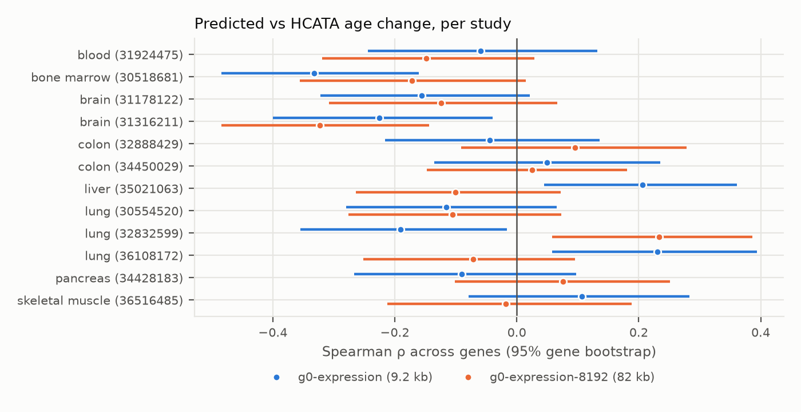
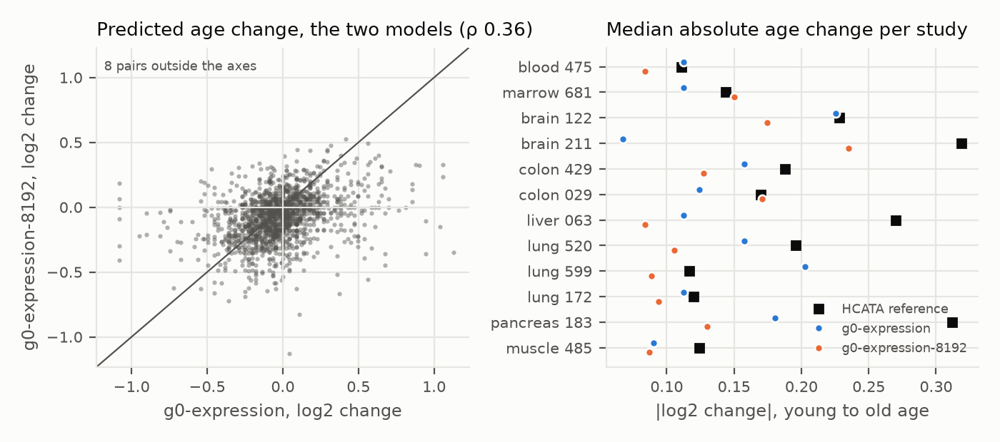
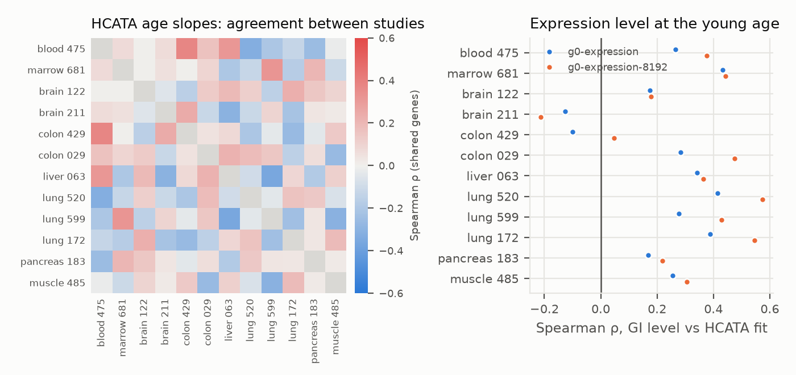

# GI Expression Predictions of Age-Related Changes Across 12 Human Studies (HCATA)

*150-gene panel, two GI expression models  |  4 October 2026*

*Converted from [gi_hcata_12_study_150_gene_report.docx](gi_hcata_12_study_150_gene_report.docx); the DOCX is the source of record.*

Neither GI expression model reproduced HCATA's age-related expression changes. Across the 12 studies, the correlation of predicted with reported age changes was -0.051 for g0-expression and -0.032 for g0-expression-8192 (all gene-study pairs pooled). Median per-study correlations were -0.075 and -0.086.

Some studies had bootstrap intervals excluding zero, but in both directions: 2 above and 3 below zero for g0-expression, 1 above and 1 below for g0-expression-8192. The two models agreed on expression levels (ρ 0.82) but only weakly on predicted age changes (ρ 0.36), so individual study results often changed sign between models. The HCATA references are themselves weak: 0–5 panel genes per study pass adjusted p \< 0.05 (21 in the pancreas study), and the same-tissue studies agree poorly with each other.

This study extends the earlier 150-gene muscle pilot. It used the same frozen gene panel, but scored it against HCATA's single-cell age effects in 12 human studies covering 8 tissues, with two GI expression models. Only the donor age and tissue in the text description change between paired requests; the DNA input of each gene is fixed.

<figure>

<figcaption>
Figure 1. Each row is an HCATA study (tissue and PubMed ID). The point is the Spearman correlation, across panel genes, between the GI-predicted log2(TPM+1) change from the study's young to old age and HCATA's annual log2 fold change multiplied by the same age gap. Lines are 95% intervals from 2,000 gene bootstrap resamples.
</figcaption>
</figure>

All 3,104 requests per model (1,552 gene-study pairs) completed with no failed predictions. This study tests age-conditioned text prompts; it does not validate a biological age clock, an intervention or a causal mechanism.

# How the experiment was performed

## Experimental reference data

The Human Cell Aging Transcriptome Atlas (HCATA) \[1\] fits, for every gene and cell-type context of each included single-cell study, a regression of normalised expression on donor age. Its public API reports the annual log2 fold change (lfc), the fitted slope and intercept, and a −log10 adjusted p value. The repository already held HCATA's full responses for the 150 panel genes, retrieved for the muscle benchmark (data/hcata_muscle_v1/source). These responses include every human study that reports these genes: 12 studies and 28,818 gene-context effects.

For each study, the primary target was its combined 'All Cells' context. The reference age change for a gene was lfc × (old age − young age). Effects were never filtered by significance, and rounded-zero coefficients were kept. Two HCATA context labels are swapped relative to the studies: PMID 36108172 is labelled 'Liver' but is a COPD lung study, and PMID 35021063 is labelled 'Lung2' but is a hepatic macrophage study. The PubMed titles and HCATA's own sample table agree on lung and liver respectively, and these were used. PMID 30554520 has an empty tissue label (lung).

| **PMID** | **Tissue** | **Ages used** | **Donor ages** | **Genes** | **Adj. p \< 0.05** | **Cohort note** |
|----|----|----|----|----|----|----|
| 31924475 | blood | 38 / 75 | 28–80 | 122 | 0 | head and neck cancer cohort; HCATA samples are blood and mouth |
| 30518681 | bone marrow | 30 / 66 | 24–84 | 122 | 0 | disease status NULL in HCATA |
| 31178122 | brain | 18 / 75 | 18–75 | 131 | 2 | 5 of 43 samples Alzheimer/CAA |
| 31316211 | brain | 35 / 64 | 34–82 | 123 | 2 | 12 of 21 samples multiple sclerosis |
| 32888429 | colon | 35 / 82 | 35–90 | 127 | 3 | labelled healthy |
| 34450029 | colon | 47 / 81 | 35–91 | 137 | 0 | 54 of 98 samples adenocarcinoma |
| 35021063 | liver | 46 / 73 | 28–75 | 123 | 5 | includes obesity/type 2 diabetes samples |
| 30554520 | lung | 22 / 71 | 21–72 | 136 | 0 | 5 of 17 samples interstitial lung disease |
| 32832599 | lung | 31 / 70 | 20–80 | 140 | 0 | 32 of 78 samples interstitial lung disease |
| 36108172 | lung | 53 / 77 | 33–81 | 144 | 4 | 6 of 12 samples COPD |
| 34428183 | pancreas | 14 / 66 | 14–66 | 123 | 21 | labelled healthy; islet study |
| 36516485 | skeletal muscle | 20 / 82 | 19–90 | 124 | 0 | labelled healthy; source study includes frailty |

The young and old ages are each study's 10th and 90th percentile donor ages in HCATA's sample table, so both fall inside the observed cohort. Several cohorts include disease samples (COPD, interstitial lung disease, colorectal cancer, multiple sclerosis, obesity/type 2 diabetes, head and neck cancer). HCATA's regressions pool them, and the GI descriptions do not mention disease.

## Gene panel and DNA inputs

The panel is the frozen 150-gene panel of the muscle benchmark: 50 HAGR age-up, 50 HAGR age-down and 50 expression-matched background genes. Of these, 148 have HCATA records; per study, 122–144 genes have an 'All Cells' effect. No genes were added or removed after seeing results.

Sequences came from Ensembl release 115 (GRCh38 primary assembly). For each gene, the TSS of the Ensembl canonical transcript was taken, and 40,960 bases on each side were extracted on the gene's sense strand (81,921 bp; at most 1.2% N). Each request sent this sequence with tss_index 40,960, and the API cut each model's own window around it: 9,198 bp for g0-expression and up to 82 kb for g0-expression-8192. The same sequence was used for every condition of a gene. Its SHA-256 is recorded in sequences.tsv.gz.

## Exact descriptions

Template: Human \<tissue phrase\> from a(n) \<age\>-year-old donor.

Example (skeletal muscle): Human skeletal muscle tissue from a 20-year-old donor. / … from an 82-year-old donor.

The tissue phrases were lung tissue, bone marrow, liver tissue, skeletal muscle tissue, colon tissue, pancreatic tissue, brain tissue and blood. The word 'adult' was dropped because the youngest pancreas age is 14. Each gene-study pair received one young and one old request per model. No baseline or alternative-wording controls were run in this study.

## Models and execution

Predictions used the Genomic Intelligence REST API \[2\] (POST /v1/tasks/expression/predict). g0-expression-8192 ran first (2026-10-03 19:17–19:35 UTC), then g0-expression (2026-10-03 19:41–19:44 UTC), each with 3,104 requests and 0 failures. The model id returned in every response matched the requested model. Requests ran 16 at a time under a rate limiter that follows the API's RateLimit headers. The GI response field expression_tpm was used as TPM.

# What the quantitative results mean

The primary statistic is the Spearman correlation across genes, within a study, between the predicted change log2(TPM_old + 1) − log2(TPM_young + 1) and the reference change. It asks whether genes predicted to rise most with age are those HCATA reports rising most. It does not test absolute TPM calibration: HCATA values are normalised single-nucleus or single-cell counts, not TPM. The intervals resample genes, not donors. The permutation P value shuffles the reference across genes within a study (2,000 permutations, two-sided). All P values are exploratory and unadjusted for the 24 tests.

| **PMID** | **Tissue** | **n** | **ρ g0-expression \[95% CI\]** | **P** | **ρ g0-expression-8192 \[95% CI\]** | **P** |
|----|----|----|----|----|----|----|
| 31924475 | blood | 122 | -0.06 \[-0.24, 0.13\] | 0.519 | -0.15 \[-0.32, 0.03\] | 0.108 |
| 30518681 | bone marrow | 122 | -0.33 \[-0.48, -0.16\] | \< 0.001 | -0.17 \[-0.36, 0.02\] | 0.065 |
| 31178122 | brain | 131 | -0.16 \[-0.32, 0.02\] | 0.070 | -0.12 \[-0.31, 0.07\] | 0.164 |
| 31316211 | brain | 123 | -0.23 \[-0.40, -0.04\] | 0.012 | -0.32 \[-0.48, -0.14\] | \< 0.001 |
| 32888429 | colon | 127 | -0.04 \[-0.22, 0.14\] | 0.614 | 0.10 \[-0.09, 0.28\] | 0.285 |
| 34450029 | colon | 137 | 0.05 \[-0.14, 0.24\] | 0.572 | 0.02 \[-0.15, 0.18\] | 0.788 |
| 35021063 | liver | 123 | 0.21 \[0.04, 0.36\] | 0.023 | -0.10 \[-0.26, 0.07\] | 0.270 |
| 30554520 | lung | 136 | -0.12 \[-0.28, 0.07\] | 0.168 | -0.11 \[-0.28, 0.07\] | 0.217 |
| 32832599 | lung | 140 | -0.19 \[-0.35, -0.02\] | 0.022 | 0.23 \[0.06, 0.39\] | 0.006 |
| 36108172 | lung | 144 | 0.23 \[0.06, 0.39\] | 0.006 | -0.07 \[-0.25, 0.10\] | 0.410 |
| 34428183 | pancreas | 123 | -0.09 \[-0.27, 0.10\] | 0.311 | 0.08 \[-0.10, 0.25\] | 0.400 |
| 36516485 | skeletal muscle | 124 | 0.11 \[-0.08, 0.28\] | 0.232 | -0.02 \[-0.21, 0.19\] | 0.851 |
| All | pooled | 1552 | -0.05 |  | -0.03 |  |
|  | median study |  | -0.07 |  | -0.09 |  |

4 of 12 study correlations were positive for g0-expression and 4 for g0-expression-8192. Intervals excluding zero: g0-expression bone marrow 30518681 (-0.33), brain 31316211 (-0.23), liver 35021063 (0.21), lung 32832599 (-0.19), lung 36108172 (0.23); g0-expression-8192 brain 31316211 (-0.32), lung 32832599 (0.23). Chance alone would give about 0.6 such studies per model, so g0-expression shows more than expected. However, these results go in both directions and mostly do not replicate in the other model. The only results pointing the same way in both models are negative. The multiple sclerosis brain study (-0.23 / -0.32) excludes zero in both. The bone-marrow study (-0.33 / -0.17) excludes zero only for g0-expression. In both, predictions run opposite to HCATA.

| **Additional measure** | **g0-expression** | **g0-expression-8192** |
|----|----|----|
| Direction agreement, median over studies | 50.9% | 49.4% |
| Studies with permutation P \< 0.05 | 5 | 2 |
| Median \|predicted age change\|, log2 | 0.135 | 0.122 |
| Per-gene sign consistency across studies (median) | 58% | 67% |

Direction agreement counts genes where both the predicted and reported changes are nonzero. The median \|reference change\| across studies was 0.179 log2 units, comparable in size to the predicted changes. For a given gene, the predicted direction of change is the same in 58% (g0-expression) and 67% (g0-expression-8192) of studies at the median. The models therefore give each gene a partly consistent 'age response', but it does not line up with HCATA's.

## Agreement between the two models

The two models agree closely on expression levels: Spearman 0.82 over all 6,208 predicted values. They agree only modestly on predicted age changes: Spearman 0.36, with the same sign for 67% of pairs. Their per-study correlations with HCATA are only weakly related (Spearman 0.38 across the 12 studies). For example, lung study 32832599 gives 0.23 with g0-expression-8192 and -0.19 with g0-expression, while liver changes from -0.10 to 0.21.

<figure>

<figcaption>
Figure 2. Left: predicted age changes for all 1,552 gene-study pairs from the two models; the diagonal marks identical predictions. Right: per study, the median absolute predicted age change for each model and the median absolute HCATA reference change.
</figcaption>
</figure>

# Checking the experimental references

## Agreement between HCATA studies

The age slopes in HCATA agree little between studies of the same tissue. For the panel genes, the three lung studies correlate at -0.04, 0.16, -0.24, the two colon studies at 0.05 and the two brain studies at -0.05. The median over all study pairs is 0.02. A model that predicted one tissue's ageing exactly could not correlate highly with another study of the same tissue. Weak agreement with any single reference therefore cannot by itself diagnose model failure.

<figure>

<figcaption>
Figure 3. Left: Spearman correlation of HCATA annual log2 fold changes between studies, over shared panel genes ('All Cells' contexts). Right: Spearman correlation between the GI predicted expression level at each study's young age and HCATA's fitted expression at that age (intercept + slope × age). The right panel is a baseline expression diagnostic, not an age test.
</figcaption>
</figure>

The models' predicted levels track HCATA's fitted expression levels moderately: median Spearman 0.27 (g0-expression) and 0.37 (g0-expression-8192) across studies. The models therefore capture which genes are highly or lowly expressed in these tissues, which makes the absence of age agreement a statement about the age response rather than about expression levels in general.

# Interpretation and limits

This study did not find a reproducible positive association between GI's age-conditioned predictions and HCATA's reported age effects. This holds for both models, and for every tissue with more than one study. The negative associations in the multiple sclerosis brain study and in bone marrow are not explained, and both cohorts have unusual composition.

## What this study can support

The workflow scores a fixed gene panel against 12 independent single-cell age references with two models, reproducibly and without failures. It also reports reference consistency and expression level diagnostics alongside the age comparison. The same code can extend the study to HCATA's full gene universe (29,166 genes). Its effects crawl was tested on 50 genes; the full crawl would take an estimated 30–40 hours against HCATA's public API.

## What remains unresolved

Reference strength. HCATA's age effects are mostly non-significant point estimates from small cohorts with disease samples and uncertain cell composition. The same-tissue studies disagree with one another. Intervals resample genes, not donors.

Prompt specificity. No same-age wording controls were run here. In the earlier muscle pilot, rewording an age-25 description shifted predictions more than the age contrast did. Any age response measured here is therefore of uncertain specificity.

Training independence. GI's catalogue lists ENCODE, GTEx/recount3 and cellxgene pseudobulk among its training data. Overlap with the HCATA source studies has not been checked.

Scope. The text changes while the reference DNA stays fixed, so this probes context conditioning, not age-related genomic change. Only the combined 'All Cells' context was scored; HCATA's cell-type effects were not used.

## Recommended next experiment

Score cell-type contexts with matching cell-type descriptions, and add same-age wording and irrelevant-context controls before inference. Restrict the primary comparison to genes with precise and cross-study consistent age effects, and verify that the evaluation cohorts are excluded from GI's training data.

# Reproducibility and sources

Everything is in this repository. scripts/hcata_full.py builds the tables (genes, effect-tables, sequences, requests), runs the predictions (predict, cached per request) and computes the per-study evaluation (evaluate). scripts/hcata_panel_report.py produces this report, its figures and stats JSON. data/hcata_panel150_v1 holds the panel, study curation (studies.tsv), primary targets, sequence metadata and hashes, requests, predictions for both models (with GI request IDs) and per-study pair tables. Raw GI responses are cached outside the repository.

Panel: 150 genes; 1,552 gene-study pairs; 3,104 requests per model; 0 failed requests. Bootstrap and permutation seed 20261004, 2000 iterations each.

## References

\[1\] Bartz J et al. Human Cell Aging Transcriptome Atlas (HCATA): a single-cell atlas of age-associated transcriptomic alterations across human tissues. Communications Biology (2025). https://doi.org/10.1038/s42003-025-08845-8 Portal: http://hcata-xiaodonglab.org:3304

\[2\] Genomic Intelligence. REST API contract (OpenAPI 2026.10.02.6) and expression model catalogue. https://api.genomicintelligence.ai/v1/openapi.json

\[3\] Ensembl release 115, GRCh38 primary assembly and gene annotation. https://ftp.ensembl.org/pub/release-115/

\[4\] Human Ageing Genomic Resources. Ageing expression signatures (panel selection). https://www.genomics.senescence.info/genes/microarray.php

\[5\] Source studies (HCATA 'All Cells' contexts): PubMed IDs 36108172, 32832599, 30554520, 30518681, 35021063, 36516485, 34450029, 34428183, 32888429, 31316211, 31924475, 31178122. https://pubmed.ncbi.nlm.nih.gov/

\[6\] Earlier report in this repository: GI expression predictions of age-related changes in human muscle, preliminary 150-gene study (reports/gi_age_expression_150_gene_report.docx).

Sources accessed 3–4 October 2026. Data and model contributions are credited to their providers. This computational analysis includes no new human sampling or laboratory experiments.
